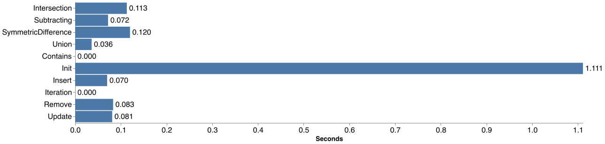
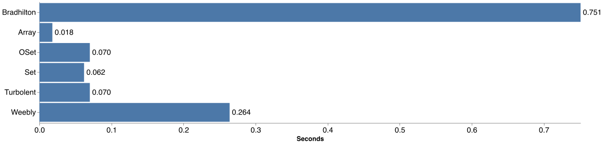
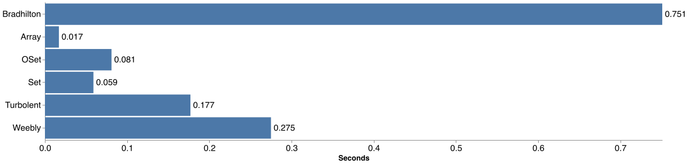
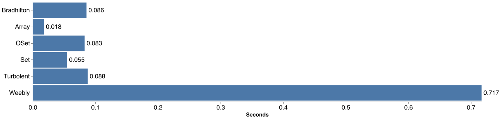
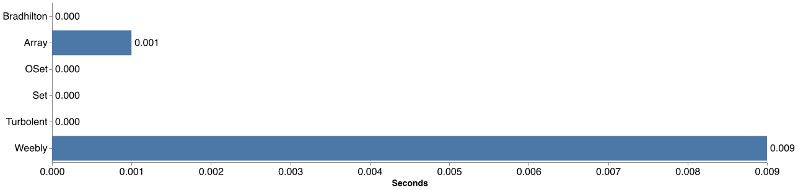
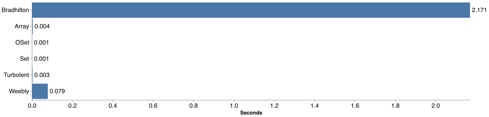
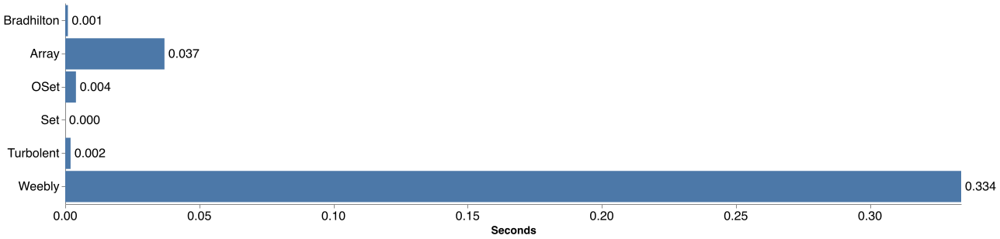
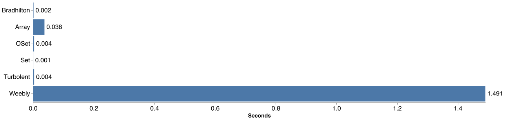
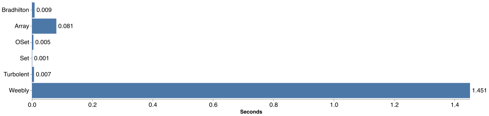

Benchmarks sources and results for [OSet](https://github.com/sciv-img/OSet).

Testing Machine: MacBook Pro, Early 2015 (i5@2.7 GHz).

Goal: Subsecond timings for all of the following.

* Insert an element into OSet of 2.000.000 entries.
* Update an element in OSet of 2.000.000 entries.
* Remove an element from OSet of 2.000.000 entries.
* Check that OSet of 2.000.000 entries contains an element.
* Union two OSets of 100.000 entries each.
* Intersection of two OSets of 100.000 entries each.
* Subtracting two OSets of 100.000 entries each.
* Symmetric Difference of two OSets of 100.000 entries each.
* Iteration over an OSet of 100.000 entries.

Other than that, comparison benchmarks were performed against stdlib `Array` and `Set` (as reference) and two other Ordered Set implementations found, [`Bradhilton`](https://github.com/bradhilton/OrderedSet) and [`Weebly`](https://github.com/Weebly/OrderedSet). The last one is not adapted to work with SwiftPM, but it is one file, so it was copied over to this repository, without changes.

Due to some operations being very slow, to prevent comparison benchmarking from taking hours (literally) and producing almost unreadable results, some operations were stepped down in number of entries to 2.000. Said operations are: *Union*, *Intersection*, *Symmetric Difference* and *Subtracting*.

# Run it yourself

Run benchmarks alone with `swift test`.

Create charts with `./chart.js` [requires `nodejs` and `vega` library].

# OSet Results

# Comparison Results
## Insert

## Update

## Remove

## Contains

## Union

## Intersection

## Subtracting

## Symmetric Difference

## Iteration

